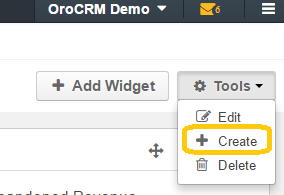

.. _user-guide-dashboards:

Dashboards
==========

Dashboards are adjustable views that contains a number of widgets to display metrics and pipelines, and to gain quick 
access to regularly used activities, such as today's calendar, recent calls and emails, quick launchpad etc. 

If permitted by the company's :ref:`access settings <user-guide-user-management-permissions-basic>`, OroCRM users can 
create numerous dashboards, configure each of them, and switch between them. This way each dashboard can be sharpened 
to specific needs, e.g. one for e-commerce, one for business-to-business sales and one for internal work-related issues.

Once you have created a dashboard, it will be available for all the users who have corresponding permissions. This way 
the same dashboard can be used by all the members of a team, and a head of a department can 
develop a dashboard that will be used by all of the employees.

From this article you can learn how to create and configure dashboards and define the users, to which it will be 
available.

Create a New Dashboard
----------------------

There are two ways to **start creating a new dashboard**

You can: 

- Go to the Dashboards section (in the Desktop UI it is signed with the icon |IcDashboard|).
  
- Click the :guilabel:`Tools` button in the top right corner of the grid.

- Click *"Create"*.

|

|

Or:

- Go to the Dashboards section and select *"Manage Dashboards"*.
  
- Click the :guilabel:`Create Dashboard` button in the top right corner of the grid.

- The *"Create Dashboard"* form will emerge.

The following fields are mandatory and **must** be specified:

.. csv-table::
  :header: "Field", "Description"
  :widths: 10, 30

  "**Label**","Name used to refer to the dashboard in the system"
  "**Clone from**","Choose an existing dashboard to be used as a base for a new one. 
  
  This is convenient, if two dashboard don't differ much or if one of them is an extended version of another one (e.g.
  a dashboard sharpened for the aims of a usual sales manager and for the head of the sales department). 

  If you want to create the dashboard from the scratch, choose the option *Blank Dashboard*."
  "**Owner**","Limits the list of users that can manage the dashboard to the users,  whose 
  :ref:`roles <user-guide-user-management-permissions>` allow managing dashboards of the owner (e.g. the owner, 
  members of the same business unit, head of the department, etc.)."

To save the dashboard, click the button in the top right corner of the page. 

It has been added to the system.

Initially, the dashboard will contain all the widgets of the dashboard it has been cloned from. (Dashboards cloned 
from the Blank Dashboard will be empty).

      |

.. image:: ./img/dashboards/blank_dashboard.png

Manage Dashboard
----------------

Add Widgets to a Dashboard
^^^^^^^^^^^^^^^^^^^^^^^^^^

      |
  
In order to add a widget to a Dashboard:

- Get to the Dashboard to which the Dashboard should be added

- Click the :guilabel:`+ Add Widget` button. 

- The drop-down will appear. 

  It contains all the widgets available in the system and haven't been added to the dashboard yet.

  For each widget you can see its name and brief description:

  |
  
  |WidgetList|

  |
  
- Choose the widget that you want to add and click the :guilabel:`Add` button.

.. note::

    There is a number of dashboards pre-implemented in OroCRM out-of-the-box. Additional widgets can be added in the 
    course of the system integration.

Description of all the available widgets and their settings is available in the 
:ref:`Widget List <user-guide-widget-list>`
  
Manage Widgets on a Dashboard
^^^^^^^^^^^^^^^^^^^^^^^^^^^^^

      |

You can manage widgets, using tools in their header:

      |
 
.. image:: ./img/dashboards/header.png

|

The header of each widget (above) contains (from left to right):

- Collapse/Expand button: if a widget has been collapsed, only its header will be displayed on the dashboard.

- Widget name: widget title displayed on the dashboard.

- Move button: click the button and hold the mouse button, to move the widget around the dashboard.

- Settings button: click the button to adjust the widget. You can change:

  - Widget title: the name displayed on the dashboard.
  
  - Date range: time for which the widget details are displayed.
  
  - Other widget details if any.

  |  
  
  |ManageWidget|

  |
  
Switch Between Dashboards
^^^^^^^^^^^^^^^^^^^^^^^^^

You can switch to a dashboard in one of the two ways:

- Use the drop-down menu under the Dashboards section

  |
  
  |SectionDropD|

  |
  
- Use the drop-down menu in the header of the Dashboard page.
 
  |
  
  |HeaderDropD|

  |

Dashboard Tools
^^^^^^^^^^^^^^^

      |

Instead of action icons of the grids, dashboard view has tools. 

      |

.. image:: ./img/dashboards/dashboard_tools.png

| 

- Get to the :ref:`Edit form <user-guide-ui-components-create-pages>` of the dashboard: |IcEdit| 

- Delete the dashboard from the system: |IcDelete| 

- Get to the Create form of the dashboard: |Bplus| 

.. hint::

    You can also perform these actions from the Dashboards grid (*Dashboards → Manage Dashboards*)

    |DActionIcons|

.. |IcDelete| image:: ./img/buttons/IcDelete.png
   :align: middle

.. |IcEdit| image:: ./img/buttons/IcEdit.png
   :align: middle

.. |IcView| image:: ./img/buttons/IcView.png
   :align: middle
   
.. |Bplus| image:: ./img/buttons/Bplus.png
   :align: middle
   
.. |IcBulk| image:: ./img/buttons/IcBulk.png
   :align: middle
   
.. |IcDashboard| image:: ./img/buttons/IcDashboard.png
   :align: middle   

.. |SectionDropD| image:: ./img/dashboards/section_dd.png
   :align: middle   
   
.. |HeaderDropD| image:: ./img/dashboards/header_dd.png
   :align: middle   
   
.. |WidgetList| image:: ./img/dashboards/widget_list.png
   :align: middle      

.. |ManageWidget| image:: ./img/dashboards/manage_widget.png
   :align: middle 
   
.. |DActionIcons| image:: ./img/dashboards/dashboard_action_icons.png
   :align: middle 
