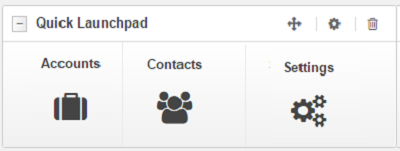
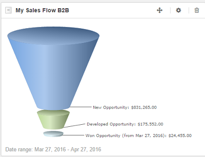
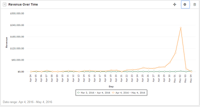

.. _user-guide-widget-list:

Widget List
===========

Dashboards are adjustable views that contains a number of widgets to display metrics and pipelines, and to gain quick 
access to regularly used activities, such as today's calendar, recent calls and emails, quick launchpad etc. Widgets can 
be adjusted and tailored to correspond the needs of a specific user.

In the :ref:`Dashboards Guide <user-guide-dashboards>` you can learn how to create and configure dashboards and define 
the users that will have access to it. 

This guide contains the list of available widgets and their description. The widgets are allocated by the roles they fit 
best. 

Commonly Used Widgets
---------------------

.. csv-table::
  :header: "Widget", "Description", "Available Settings"
  :widths: 40, 30, 30

  "**Quick Launchpad**
  
  |QuickLP|","From the widget, you can access the actions and pages you've used the most. As you are using 
  the system, the will be updated, so you can easily reach the most necessary pages and actions directly from the 
  dashboard.","You can change the name that will be displayed in the widget header."
  "**Recent Emails**
  
  |RecentEmails|","From the widget, you can see the latest emails received and sent by you. You can:
  
  - See emails in your inbox (click the *Inbox* tab)
  - See ten latest unread emails (click the *Unread Emails* tab)
  - See ten latest sent emails (click the *Sent* tab)
  - Get to the View pages of the emails senders/recipients (click the name link in the from/to field)
  - Get to your mailbox (click the *View All* link)*
  
  ","You can change the name that will be displayed in the widget header."
  "**Todays Calendar**
  
  |TodaysCalendar|","The widget displays your :ref:`calendar <user-guide-calendars>` for today. From the widget, you can:
  
  - Access any of the events, scheduled for today (click on the event in the calendar)
  - Add events for today (click the :guilabel:`New Event` button)
  - Get to your calendar (click the *My Calendar* link)
  
  ","You can change the name that will be displayed in the widget header."
  
  
Widgets for Direct Communications with Customers
------------------------------------------------
  
These widgets will help to access contacts and accounts, as well as view the latest call-details directly from the 
dashboard. These widgets are of particular use for sales-managers, and can be also used by support teams, marketing
associated and other employees directly interacting with customers and/or working with the customer-related details.

 

.. csv-table::
  :header: "Widget", "Description", "Available Settings"
  :widths: 40, 30, 30

  "**Recently accessed accounts**
  
  |RAAcoounts|","From the widget, you can see the latest ten :ref:`accounts <user-guide-accounts>` accessed. You can:
  
  - Get to the View page of any of the accounts shown (click the account name)
  - Get to the *All Accounts* grid (click the *View All* link)
  
  ","You can change the name that will be displayed in the widget header."
  "**Recently accessed contacts**
  
  |RAContacts|","From the widget, you can see the latest ten :ref:`contacts <user-guide-contacts>` accessed. You can:
  
  - Get to the View page of any of the contacts shown (click the contact name)
  - Get to the *All Contacts* grid (click the *View All* link)
  
  ","You can change the name that will be displayed in the widget header."  
  "**Recent calls**
  
  |RecentCalls|","From the widget, you can see the latest ten outgoing and incoming 
  :ref:`calls <user-guide-activities-calls>` logged. You can:
  
  - View details of any call logged (click the call subject)
  - Get to the *All Calls* grid (click the *View All* link)
  
  ","You can change the name that will be displayed in the widget header."
  
  
Sales Management Widgets
------------------------
  
These widgets are particularly useful to manage sales processes, and understand the developing trends and perspectives.

.. csv-table::
  :header: "Widget", "Description", "Available Settings"
  :widths: 40, 30, 30
   
  "**Opportunities By Lead Source**
  
  |OppByLS|","You can see the pie-chart representing the opportunities by lead source report for the defined 
  time-range","You can change:

  - the name that will be displayed in the widget header
  - the date-range for which the report is generated
  
  "
  "**Opportunities By Status**
  
  |OppByStatus|","You can see the chart representing the number of lost, won and in-progress opportunities for the 
  defined time-range","You can change the name that will be displayed in the widget header, and redefine the date-range 
  for which the report is generated."

  "**Average lifetime sales**","","You can change:

  - the name that will be displayed in the widget header
  - the date-range for which the report is generated
  
  "
  "**My Sales Flow B2B**
  
  |B2BSalesFlow|","You can see the funnel-chart with total amount for each step of the sales process workflow", "You 
  can:
  
  - change the name that will be displayed in the widget header
  - redefine the date-range for which the report is generated.
  
  "
  "**Forecast**
  
  |Forecast|","You can see the forecast for all opportunities or opportunities of specific business unit(s) and assigned 
  to specific owners as of today and (optionally) compared to a defined date. This can be forecast for the opportunities 
  in progress, total forecast and weighted forecast","You can change:
  
  - the name that will be displayed in the widget header 
  - the owner and business units for which the forecast will be created (if any) 
  - the date to which the forecast will be compared (if any) 
  - the metrics processed:

    - Opportunities in progress
    - Total forecast
    - Weighted forecast
  "
  "**B2B Statistics**

  ","","You can change:

  - the name that will be displayed in the widget header 
  - the owner and business units for which the forecast will be created (if any) 
  - the date to which the forecast will be compared (if any) 
  - the metrics processed:
  
    - New Leads
	- Leads for the period
	- New Opportunities
	- Opportunities for the period
	- Total pipeline amount
	- Weighted pipeline amount
  "

Marketing-Oriented Tools
------------------------

These widgets are particularly useful for marketing associates and other employees involved in development and 
assessment of marketing campaigns.

.. csv-table::
  :header: "Widget", "Description", "Available Settings"
  :widths: 40, 30, 30

  "**Campaigns by close revenue**  
  
  |CampbyRevenue|","You can see five campaigns that generated the highest revenue for the defined period of time.","You 
  can change: 
  
  - the name that will be displayed in the widget header
  - the date-range for which the report is generated
  
  "
  "**Opportunity-generating campaigns**
  
  |CampbyOpp|","You can see five campaigns that generated the biggest number of opportunities 
  for the defined period of time.","You can change: 

  - the name that will be displayed in the widget header
  - the date-range for which the report is generated

  "
  "**Campaigns leads**
  
  |CampbyLeads|","You can see the number of leads generated by five most recent campaigns within the defined time 
  period.","You can change: 

  - the name that will be displayed in the widget header
  - the date-range for which the report is generated

  " 

eCommerce-Oriented Widgets
--------------------------

These widgets provide you access to eCommerce data, particularly of the Magento-based stores, directly from the 
dashboard. 

.. csv-table::
  :header: "Widget", "Description", "Available Settings"
  :widths: 40, 30, 30

  "**Ecommerce Statistics**
  
  |EcomStat|","You can view selected metrics of the eCommerce activity for a specified period of time. Optionally, you 
  can also compare the metrics value against similar values for the previous period.","You can change:

  - the name that will be displayed in the widget header 
  - the date-range for which the statics will be created
  - whether the values need to be compared against the previous period
  - what metrics will be included:
  
    - Revenue
	- Orders placed
	- Site visits
	- Customer conversion rate
	- Order conversion rate
	- Discounted orders
	- New customers
  
  "
  "**My Sales Flow B2C**
  
  |B2CSalesFlow|","You can view the funnel chart representing the state of your B2C workflow for a defined period of 
  time","You can change:

  - the name that will be displayed in the widget header 
  - the date-range for which the statics will be created
  
  "
  "**Average order amount**
  
  |OrderAmount|","You can view the line chart representing average order amount for each data channel.","You can change:

  - the name that will be displayed in the widget header 
  - the date-range for which the statics will be created
  
  "
  "**New Magento Customers**
  
  |MagCustomers|","You can view the line chart representing the number of new magento customers for a period of 
  time","You can change:

  - the name that will be displayed in the widget header 
  - the date-range for which the statics will be created
  
  "
  "**Revenue over time**
  
  |RevenueTime|","You can view the line chart representing the average revenue of the magento-based 
  channels for a period of time","You can change:

  - the name that will be displayed in the widget header 
  - the date-range for which the statics will be created
  
  "
  "**Orders over time**

  |OrdersTime|","You can view the line chart representing the number of orders of the magento-based 
  channels for a period of time","You can change:

  - the name that will be displayed in the widget header 
  - the date-range for which the statics will be created
  
  "
  "**Purchase Funnel**
  
  |PurchaseFunnel|","You can view the funnel chart representing current state of carts of purchases","You can change:

  - the name that will be displayed in the widget header 
  - the date-range for which the statics will be created
  
  "
  

   

   

   

  

.. |CampbyRevenue| image:: ./img/dashboards/wl_camp_by_cr.png
   :align: middle     

   

   

   
   
   
